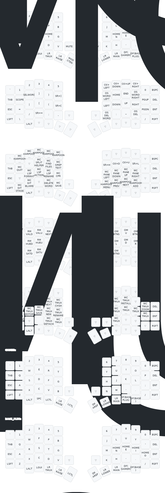

# Artur's QMK Keymap


Highly inspired by: [getreuer](https://getreuer.info/posts/keyboards/tour/index.html)

## Keyboard

Sofle v2 Choc with RP2040 controller

## My Keymap



## License

This code uses the Apache License 2.0. See the [LICENSE file](LICENSE.txt) for details.

## Installation

Clone the [QMK firmware](https://github.com/qmk/qmk_firmware) and place this
repo in `qmk_firmware/keyboards/sofle_choc/keymaps/arturgoms`.

1. Compile
```bash
qmk compile -kb sofle_choc -km arturgoms -e CONVERT_TO=rp2040_ce
```

2. Flash
   - Put the RP2040 into bootloader mode (hold BOOT button while plugging in, or double-tap RESET)
   - It will appear as a USB drive (usually named `RPI-RP2`)
   - Drag the `.uf2` file from `qmk_firmware/.build/` to the drive
   - The controller will automatically reboot with the new firmware

## Generating the Keymap SVG

To regenerate the `doc/sofle.svg` keymap image:

1. Generate the YAML file from the keymap source:
```bash
qmk c2json keyboards/sofle_choc/keymaps/arturgoms/keymap.c --no-cpp \
  | keymap parse --layer-names BASE LOWER RAISE MAINTENANCE TMUX GAMER BASE_PLUS -c 14 -q - \
  > ~/projects/personal/qmk-keymap/sofle_keymap.yaml
```

2. Upload `sofle_keymap.yaml` to [keymap-drawer](https://keymap-drawer.streamlit.app) to generate the SVG
