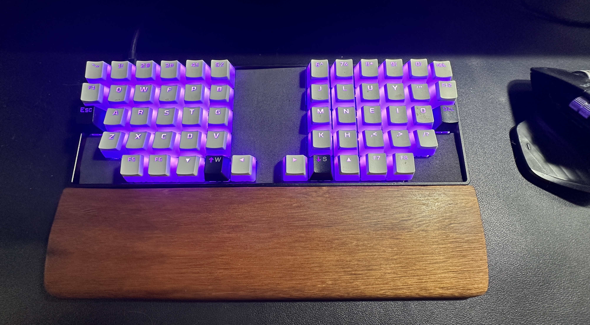
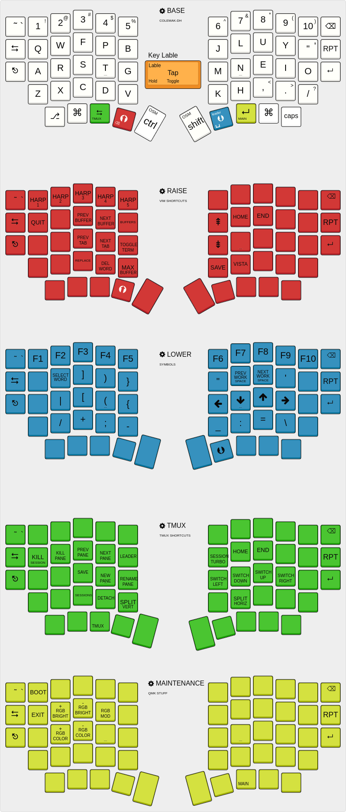

#  Artur's QMK keymap



Highly inspired by: [getreuer](https://getreuer.info/posts/keyboards/tour/index.html)  Artur's QMK keymap

## My keymap



## License

This code uses the Apache License 2.0. See the [LICENSE file](LICENSE.txt) for
details.


## Installation

Clone the [QMK firmware](https://github.com/qmk/qmk_firmware) and place this
repo in `qmk_firmware/keyboards/idobao/id75/keymaps/arturgoms`.

1. Compile
```Bash
qmk compile  -kb idobao/id75/v2 -km arturgoms
```
2. Flash
```Bash
qmk flash  -kb idobao/id75/v2 -km arturgoms
```
